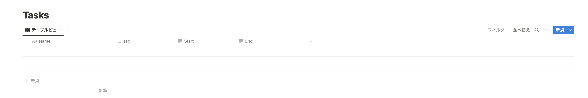

# Task Fast

個人用タスク管理アプリを作る予定のリポジトリ。

## 使い方
現在はCLIからLocalで起動する方法しかサポートしていません  
このアプリはタスクの実行履歴をNotionのDBに保存します。自身でアクセスできるNotion環境にDBを用意してください。  
また、DBのスキーマは以下のように設定してください。

### 1. NotionのDBを用意する
以下のようなプロパティを持つDBを用意してください

| プロパティ名 | 型   |
|--------------|------|
| Name         | タイトル |
| Tag          | マルチセレクト |
| Start        | テキスト |
| End          | テキスト |

Notionの画面ではこのようになっているはずです


### 2. 作成したDBのIDを取得する
作成したDBのURLを確認し、DBのIDをコピーしてください。
後で.env.localに保存します。

#### 2.1 DBのIDの確認方法について
DBのURLの構成はこのようになっています。
```
https://www.notion.so/{DBのID}?v={ViewのID}
```
`{DBのID}`に相当する部分をDBのIDとしてコピーしておいてください。  
*Notionアプリを利用している場合、DBのURLをCtrl+Lで取得し、URLを確認してください。

### 3. NotionのAPIKeyを取得する
[Notionの開発者ページ](https://www.notion.so/my-integrations)にアクセスし、新しいIntegrationsを作成してください。

### 4. `.env.local`を`/app`に作成し、以下のように環境変数を設定する

```bash
DB_ID=xxxxxxxxxxxxxxxxxxxxxxxxxxxxxxxxxxxxxxx
SECRET_KEY=xxxxxxxxxxxxxxxxxxxxxxxxxxxxxxxxxxxxxxx
```

### 5. CLIからyarn or npmで起動する

```bash
cd app
yarn
yarn dev
```

## イメージ

